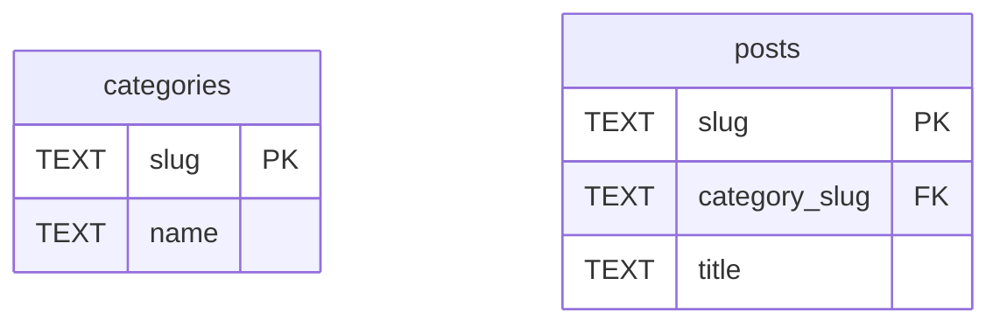

どういうこと？ってなりますよね。私はなりました。

> 🐛 BUG: when trying to left join 2 tables that have same name columns - second column is not returned · Issue #3160 · cloudflare/workers-sdk
> https://github.com/cloudflare/workers-sdk/issues/3160

## こういうこと

たとえばこういうスキーマ。



各ポストは、単一のカテゴリに属するとする。まあ、ありがちなテーブル構成かと。

重要なのは、`slug`という同名のカラムがあるところ。

で、この状態で、以下のSQLを発行すると、

```sql
SELECT
  posts.slug, categories.slug
FROM
  posts
  LEFT JOIN categories ON posts.category_slug == categories.slug
```

期待するのはこういう返り値。

```markdown
| slug   | slug       |
| ------ | ---------- |
| post-1 | category-1 |
```

素のSQLiteとか（その他のDBでも）であれば、このように返ってくる。

が、現状のD1だとこうなっちゃう。

```markdown
| slug       |
| ---------- |
| category-1 |
```

なんてこった。

## なぜか

D1の実装（たぶん`workerd`というより、D1を捌いてるらしいDOの実装かな？）がそうなってるから。

おそらくSQLiteから返ってきた結果を、JSONでレスポンスするために詰め替えるところで、同名のキーを上書きしちゃってる。

なので`wrangler d1 execute --command="..."`だろうと、`D1.prepare("...").all()`だろうと`D1.prepare("...").raw()`だろうと、どうしようもなくこうなる。

## 何が困るのか

`wrangler`からSQLを発行したり、D1のAPIを直接使ってる場合は、そもそも同じカラム名にはせず`AS`とか使うはず。なので、問題にならない。

困るのは、いわゆるORMを通した場合。個人的に言うと、DrizzleORMを使ってた場合。

DrizzleはD1のAPIでいう`.raw()`を使ってるので、この影響をもろに受けるとのこと。

> [BUG]: Broken shifted columns with leftJoin and same column name (on D1) · Issue #555 · drizzle-team/drizzle-orm
> https://github.com/drizzle-team/drizzle-orm/issues/555

Drizzleは、こういうコードを書くと、

```js
const { sql } = drizzle(D1Database)
  .select({ ps: posts.slug, cs: categories.slug })
  .from(posts)
  .leftJoin(categories, eq(posts.categorySlug, categories.slug))
  .toSQL();
```

こういうSQLに変換するらしく、

```sql
SELECT
  "posts"."slug",
  "categories"."slug"
FROM 
  "posts"
  LEFT JOIN "categories" ON "posts"."category_slug" = "categories"."slug"
```

するとさっきのD1の罠にかかって、思った通りの結果が返ってこない。なので`undefined`？！なんで？！ってなる。

ドキュメントでは`AS`が使われる風に書いてあるけど、実際は使ってないっぽい。

> SQL Select - DrizzleORM
> https://orm.drizzle.team/docs/select#basic-and-partial-select

## どうすればいいか

- Drizzleは使うが、同名カラムをJOINしないよう気をつける
  - もしくはJOINを諦めて別クエリにする
- Drizzleは使う、どうしても同名カラムをJOINしたいときは、素のD1のAPIで`AS`付けて使う
- Drizzleやめて、他のORMにする

どれもなかなかに厳しいな。
