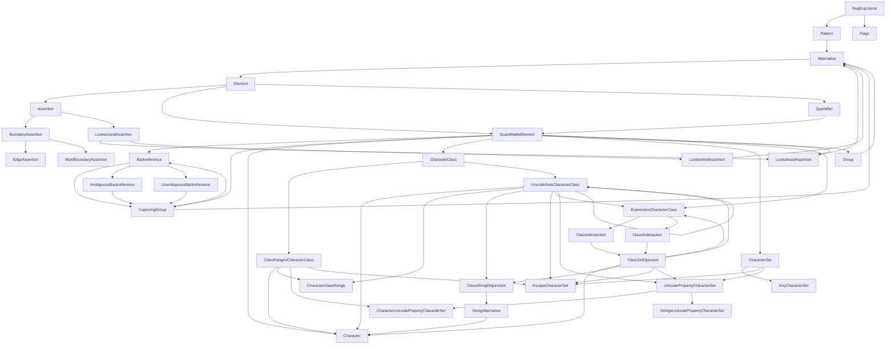

> eslint-community/regexpp: The regular expression parser for ECMAScript.
> https://github.com/eslint-community/regexpp

OXCでこれをRustにポートする必要があり、そのために。

正規表現それ自体についても別に詳しくないけど、仕様があるだけJSDocよりマシやと信じてる・・・。

直近でES2025をサポートをしようとしてるPRがあったので、せっかくなのでそこ起点で読んでみることにする。

> https://github.com/eslint-community/regexpp/commit/d7f0d662424b6cd6a7fcad5f628ca20f25cf6813

（現時点では未レビュー・未マージなので、もしかしたら変わることがあるかも・・・？）

## exportされてるAPI

> https://github.com/eslint-community/regexpp/blob/d7f0d662424b6cd6a7fcad5f628ca20f25cf6813/src/index.ts

大まかにに3つ。

- `RegExpParser`クラス
  - `parseRegExpLiteral(source, options)`
- `RegExpValidator`クラス
  - `validateRegExpLiteral(source, options)`
- `visitRegExpAST(node, handlers)`

あとは`AST`の各ノード定義と、`RegExpSyntaxError`の構造体など。

シンプルだわ。

## `RegExpParser`

> https://github.com/eslint-community/regexpp/blob/d7f0d662424b6cd6a7fcad5f628ca20f25cf6813/src/parser.ts

- 内部的な状態である`RegExpParserState`と、`RegExpValidator`のインスタンスを抱えてる
  - `RegExpValidator`には、`RegExpParserState`を渡してある
  - https://github.com/eslint-community/regexpp/blob/d7f0d662424b6cd6a7fcad5f628ca20f25cf6813/src/parser.ts#L783
- 公開メソッドは3つ
  - `parseLiteral()`
  - `parsePattern()`
  - `parseFlags()`
- これらが呼ばれるとき、対応する`RegExpValidator`の`validate(Literal|Flags|Pattern)()`が呼ばれる
- その結果、`RegExpParserState`が更新され、そのプロパティの一部を使って値をそれぞれ返す
  - 後述する`pattern`とか`flags`

というわけで、この`RegExpParser`クラスはほとんどガワであり、実体は`RegExpValidator`と、`RegExpParserState`にある。

ちなみに、`Literal`とは`/foobar/i`みたいなフルの正規表現文字列で、`Pattern`は`foobar`の部分、`Flags`は`i`の部分のこと。

### `RegExpParserState`

> https://github.com/eslint-community/regexpp/blob/d7f0d662424b6cd6a7fcad5f628ca20f25cf6813/src/parser.ts#L53

- 後述する`RegExpValidator.Options`と同じ型
- `onPatternEnter()`、`onPatternLeave()`や`onCharacter()`のような、ASTに対応したフックを持つ
- `RegExpValidator`がこれを呼び出すことで、`RegExpParserState.pattern`と`RegExpParserState.flags`のプロパティが育っていく
  - ここはいわゆるパーサーっぽい仕事してる

## `RegExpValidator`

> https://github.com/eslint-community/regexpp/blob/d7f0d662424b6cd6a7fcad5f628ca20f25cf6813/src/validator.ts

- 名前はこうなってるけど、いわゆる構文解析してるのはココ
  - `Reader`のインスタンスを抱えてて、これが`advance()`とか`eat()`とかやってる
    - https://github.com/eslint-community/regexpp/blob/d7f0d662424b6cd6a7fcad5f628ca20f25cf6813/src/reader.ts#L1-L16
  - `u`フラグの有無で、内部実装が変わる
  - `RegExpValidator`側でも同名のメソッドがマップされてて、そこから呼ばれる
    - https://github.com/eslint-community/regexpp/blob/d7f0d662424b6cd6a7fcad5f628ca20f25cf6813/src/validator.ts#L1207

Lexerというわけではなさそう。トークン化せずにそのまま`RegExpParserState`につながっていく感じ？

### `RegExpValidator#validateLiteral()`

> https://github.com/eslint-community/regexpp/blob/d7f0d662424b6cd6a7fcad5f628ca20f25cf6813/src/validator.ts#L664

最もよくあるユースケースの流れを見ておく。

- `Reader`の初期化
- `onLiteralEnter()`のフックを呼び
- 正規表現パターンに問題がないなら: `if (this.eat(SOLIDUS) && this.eatRegExpBody() && this.eat(SOLIDUS)) {`
  - `validateFlagsInternal()`でフラグを検証し、`onRegExpFlags()`のフックを呼ぶ
  - `validatePatternInternal()`でパターンの検証
- `onLiteralLeave()`のフックを呼ぶ

`validatePatternInternal()`が解析を進めていく入口になってて、

- `consumePattern()`からはじまり
  - `consumeDisjunction()`
    - `consumeAlternative()` > `consumeTerm()` > `consumeAssertion()` > `eat()`...
    - `consumeQuantifier()` > `eatBracedQuantifier()` > `eat()`...

というように、ASTを掘り進めていき、その都度`onXxx()`フックが呼ばれる。

`consumeXxx()`と`eatXxx()`の数だけ、ASTの種類があるというわけで、それを俯瞰するにはGitHubのSymbolsサイドバーが便利だった。

ASTの種類は、`AST`として固めてexportされてる。

> https://github.com/eslint-community/regexpp/blob/d7f0d662424b6cd6a7fcad5f628ca20f25cf6813/src/ast.ts

## `visitRegExpAST(node, handlers)`

> https://github.com/eslint-community/regexpp/blob/d7f0d662424b6cd6a7fcad5f628ca20f25cf6813/src/index.ts#L34

実体はこれだけ。

```ts
new RegExpVisitor(handlers).visit(node);
```

`visit()`の中身も、与えられたASTの`node.type`に応じて、`handlers`で待ち受けてるそれぞれのフックを呼び出すだけ。

`AST`もexportされてるので、これを使わず自分でイテレートしてもよいはず。

## ASTの構造

ChatGPT 4oにTSの定義を食わせて聞いたらこれが出てきた。

> https://twitter.com/leaysgur/status/1803063346918248846



あってるかわからんけど、まあ雰囲気をつかむには便利？

## 他のコード

ソースコード全体をツリー化するとこうなってる。

```
├── ast.ts
├── ecma-versions.ts
├── group-specifiers.ts
├── index.ts
├── parser.ts
├── reader.ts
├── regexp-syntax-error.ts
├── unicode
│  ├── ids.ts
│  ├── index.ts
│  └── properties.ts
├── validator.ts
└── visitor.ts
```

ほかの目ぼしいものを拾い読みすると・・・、

- ecma-versions
  - ES2025とか特定のバージョンからのみフラグが追加されたりするので、その判別のために
- group-specifiers
  - ES2025からグループ名が重複できるようになるので、その対応のために
  - https://github.com/tc39/proposal-duplicate-named-capturing-groups
- unicode/
  - 文字通り、パースしている最中の文字のコードポイントやらを判別するために

## おわりに

コンテキストはさておき、外部依存がなくて、仕様があるコードはやはり読みやすい。

おかげでだいたいの雰囲気はわかった（気がする）。ASTの詳細は追って把握しないといけなそうやけど。

とはいえ、OXCで実装する場合、そのままリライトするのではダメで、ハイパフォーマンスな`oxc_parser`の流儀に従う必要がある。

なのでそっちの雰囲気も理解しておかないと、コードに落とし込むのは難しそう。やはりOXCの本丸に攻め込む必要がありそうで、こっちのほうが難易度が高そう・・・！

